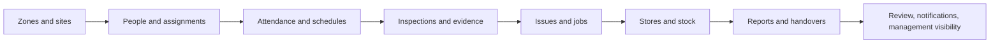

# White Bird Zanzibar Site Management

> **An accountable operating layer for teams responsible for every site, person, standard, stock item, issue, and handover.**

White Bird Zanzibar is a production-oriented site-management platform for coordinating distributed operational work. It combines a Django and Django Ninja backend with a role-aware React application, a public Coastal Ledger marketing experience, and a domain model centered on sites, zones, cleaner assignments, attendance, trainees, inspections, issues, jobs, stores, stock, reports, and notifications.

The repository is intentionally split into two experiences. The public marketing surface at `/marketing/` communicates the product and its operating model. The authenticated React workspace provides the daily command layer, while the Django-rendered operational dashboard remains available at `/dashboard/` for server-side role-specific views. The backend is always the source of authorization; the React client makes permissions understandable but never replaces server enforcement.

## Product model

White Bird is designed around the movement of work through a site-management chain:



The platform uses explicit workflow states rather than hidden transitions. A supervisor can see what is assigned to their scope, what is incomplete, what needs review, and what action is available next. A management viewer can receive read-only oversight without being given operational write authority.

## Repository architecture

| Layer | Location | Responsibility |
|---|---|---|
| Django configuration | `config/` | Settings, URL assembly, WSGI/ASGI, API composition, production configuration, and task scheduling. |
| Site-management domain | `apps/site_management/` | Sites, zones, cleaners, assignments, attendance, inspections, issues, jobs, stock, reports, dashboards, and notifications. |
| Accounts and access | `apps/accounts/` | Users, roles, authentication, refresh/revocation, permissions, and account administration. |
| React frontend | `frontend/` | Vite application, Coastal Ledger design system, public marketing page, authenticated workspaces, API client, and local development proxy. |
| Django host views | `apps/web/` | Health/readiness probes, legacy server dashboard, and collected React SPA delivery. |
| Data and migrations | `apps/*/migrations/` | Django schema evolution and migration history. |
| Operational documentation | `docs/` | API, architecture, RBAC, frontend integration, and workflow references. |
| Deployment | `Dockerfile`, `docker-compose.yml` | Multi-stage frontend build, Django runtime, PostgreSQL, Redis, and worker topology. |

## User experiences and routes

The public landing experience is served by Django at `/marketing/`. It uses a CSS-driven 3D command-layer composition instead of a heavy WebGL dependency, which keeps the marketing surface responsive, accessible, and inexpensive to render. The scene includes topographic depth, floating workflow cards, role context, and trust-layer messaging. It is not presented as a live-data dashboard and does not invent customer reviews, ratings, testimonials, or unsupported performance claims.

The application entry point is served at `/app/` after the frontend bundle has been built and collected into Django static files. The client includes authentication, a role-aware dashboard, sites and zones, cleaners, assignments, attendance, inspections, issues and jobs, stores and stock, reports, notifications, and account context. The server-rendered role dashboard remains at `/dashboard/` for compatibility and direct operational access.

The Django Ninja API is mounted below `/api/site-management/v1`. The frontend API client is centralized in `frontend/client/src/lib/api.ts`; feature pages should not construct ad hoc bearer requests.

## Technology stack

| Concern | Technology |
|---|---|
| Backend runtime | Python 3.11+, Django, Django Ninja, Celery, Redis, PostgreSQL |
| Authentication | Bearer access and refresh tokens with revocation and permission lookup |
| Frontend runtime | React, TypeScript, Vite, Wouter, Tailwind CSS 4, shadcn/ui primitives, Lucide icons |
| API integration | Typed client with bearer authorization, query serialization, response normalization, trace IDs, and structured error handling |
| Static delivery | Vite production bundle collected by Django and served from the combined image |
| Quality | Pytest, pytest-django, Ruff, TypeScript checking, Vite production build |
| Deployment | Multi-stage Docker build with separate frontend compilation and Django runtime stages |

## Local development

### Backend

Create a virtual environment, install the development requirements, and populate a local `.env` from the example configuration. A PostgreSQL and Redis service are expected for the normal development topology.

```bash
python3 -m venv .venv
source .venv/bin/activate
pip install -r requirements/dev.txt -r requirements/test.txt
cp .env.example .env
python manage.py migrate
python manage.py runserver 0.0.0.0:8000
```

For a hermetic smoke test, the repository test settings support SQLite. The normal development and production settings should continue to use PostgreSQL unless a deliberately isolated local test environment is being created.

### Frontend

The frontend lives inside the Django repository and is developed independently from the backend process. Vite proxies `/api` requests to Django, so browser requests follow the same API path used in production.

```bash
cd frontend
pnpm install
pnpm dev
```

The API base can be overridden when the client must connect to another environment:

```bash
VITE_API_BASE_URL=https://api.example.com/api/site-management/v1 pnpm build
```

When the variable is omitted for the integrated local setup, the client uses `/api/site-management/v1` and the development proxy points to the local Django server.

### Development seed and safe test data

Use the repository’s documented seed tooling only in an isolated development database. Do not copy development credentials into production, and do not use synthetic customer testimonials or ratings as product content. Operational fixtures should remain clearly identifiable as development data.

## Production build and Docker delivery

The root `Dockerfile` uses a multi-stage build. The first stage installs frontend dependencies and creates the Vite bundle. The Django stage installs Python requirements, copies the source, collects static assets, and starts the configured production process. A deployment does not depend on the sandbox asset service or local frontend files outside this repository.

Build and run the combined image with the project’s normal container workflow:

```bash
docker compose -f docker-compose.prod.yml build web
docker compose -f docker-compose.prod.yml up -d web worker beat
```

Before publishing an image, confirm that the deployment environment supplies a strong `DJANGO_SECRET_KEY`, a production PostgreSQL URL, Redis connectivity, allowed hosts, CSRF origins, CORS origins, token configuration, storage configuration, and the correct public frontend/API origins. Ensure migrations run as an explicit release step rather than implicitly during every web process start.

## Environment contract

The complete variable template is `.env.example`. The most important production values are summarized below.

| Variable group | Purpose | Production expectation |
|---|---|---|
| Django secrets | Secret key, debug flag, allowed hosts, CSRF trusted origins | Strong secret values, `DEBUG=false`, explicit host and origin allowlists. |
| Database | PostgreSQL connection URL and pool settings | Managed PostgreSQL with backups, SSL, and a least-privilege application user. |
| Cache and workers | Redis URL, Celery broker/result configuration | Managed Redis or isolated production Redis with network restrictions. |
| Auth | JWT/access-token, refresh-token, issuer, and cookie settings | Short access-token lifetime, revocable refresh tokens, secure transport, and stable issuer configuration. |
| Storage | Private file storage provider, bucket, and signing configuration | Private-by-default objects and short-lived signed downloads. |
| Frontend | `VITE_API_BASE_URL` when using a separate public API origin | Include the complete `/api/site-management/v1` path and configure Django CORS accordingly. |

## API integration boundaries

The backend contract is documented in `docs/API.md`, `docs/FRONTEND_INTEGRATION.md`, and the implementation under `config/api.py` and the relevant application API modules. The frontend expects the following broad contract categories:

| Category | Representative capabilities |
|---|---|
| Session | Login, refresh, logout, current user, permissions, account statistics. |
| Organisation | Zones, sites, departments, areas, assets, supervisors, shifts, and schedules. |
| People | Cleaners, documents, trainees, evaluations, and assignment relationships. |
| Daily operations | Attendance sheets, submissions, review/return states, and attendance summaries. |
| Standards | Inspection templates, inspection records, scoring, evidence, submit, return, and review. |
| Work queue | Issues, jobs, priorities, assignment, escalation, evidence, verify, close, and reopen. |
| Supply | Stores, items, stock movements, low-stock signals, and stock requests. |
| Oversight | Site, zone, assistant, general reports, status dashboards, exports, and notifications. |

The client treats 401, 403, 404, 409, 422, 429, 5xx, and network failures as distinct user states. A failed API request does not produce fabricated fallback records. It produces an honest loading, empty, scope, retry, or service-response state.

## Security and privacy posture

Authorization is enforced by Django. The client-side permission layer exists to make the experience understandable and to avoid inviting users into actions they cannot perform, but it must not be treated as a security boundary. Sensitive documents and private photos use backend-issued signed downloads. Secrets are not committed to the repository. Access tokens are held in memory and refresh tokens are session-scoped by the current frontend implementation; a production BFF with HttpOnly cookies is preferred when deployment topology supports it.

The application should be deployed behind TLS, with secure cookies, strict host/origin configuration, rate limits, structured audit events, centralized error logging, and a monitored readiness endpoint. Operational data should be scoped by the server before serialization; hiding a field in React is not a substitute for serializer-level access control.

## Quality gates

Run the following checks before creating a release commit:

```bash
# Backend tests
DJANGO_DEBUG=false DJANGO_SECRET_KEY=local-test-secret pytest -q

# Backend lint
ruff check apps config

# Frontend type and production checks
cd frontend
pnpm check
pnpm build
```

The browser-level smoke path should verify the public `/marketing/` page, `/app/` static delivery, the Vite development shell, health/readiness probes, login, current-user lookup, permissions, dashboard data, and at least one representative read and write workflow in a seeded non-production database. Validate desktop and mobile layouts and confirm `prefers-reduced-motion` removes non-essential 3D transforms.

## Release workflow

A release begins with a clean working tree and a reviewed change list. Backend schema changes must be migrated and tested before application rollout. Frontend changes must pass the TypeScript check and production build. The combined image should be built in CI, scanned, deployed to a non-production environment, and verified through health, API, public marketing, authentication, and role-specific workflow checks before promotion.

Use small commits that describe the system-level change, for example `feat: add public operations marketing surface` or `docs: document combined production workflow`. Push only after tests and static checks have completed. Keep rollback available through the previous image and migration compatibility window.

## Documentation map

| Document | Use |
|---|---|
| `docs/API.md` | Endpoint catalogue, response conventions, filtering, pagination, exports, and errors. |
| `docs/ARCHITECTURE.md` | Domain boundaries, data flow, services, events, and deployment topology. |
| `docs/RBAC.md` | Role scope, permissions, and frontend expectations. |
| `docs/FRONTEND_INTEGRATION.md` | API origin, authentication flow, request conventions, and frontend consumption. |
| `frontend/README.md` | Frontend-local commands and package-level development notes. |
| `TODO.md` | Current delivery backlog and execution history. |

## Design system: Coastal Ledger

The public marketing page and operations application share a restrained visual language: warm limestone surfaces for long sessions, Indian Ocean navy for authority, Reef Ledger Green for completion and trust, amber for attention, and hibiscus red for consequential failure states. Manrope is the operational UI typeface, while DM Serif Display is reserved for editorial headings. 3D depth is used to make the operating model tangible, not to decorate every interaction. Motion is short, transform-based, and disabled for users who request reduced motion.

The public story is intentionally evidence-based. White Bird’s marketing language explains what the system is designed to do, how roles and workflows relate, and how the trust layer works. It does not claim customer outcomes that are not documented in the repository and does not include fabricated customer proof.


## Operational workflow rules

The API is the authorization source for all operational workflows. A site supervisor receives site scope from active supervisor assignments; attendance sheets therefore load assigned sites rather than requiring a manually typed site ID. A supervisor can mark scheduled cleaners present or absent, capture sign-in and sign-out times, save each editable row, and submit the daily sheet for review. Submitted, reviewed, locked, and returned states remain visible in the client.

Cleaner onboarding is restricted to system administrators and users with the explicit cleaner-management permission. Supervisors can read only cleaners associated with active assignments in their visible sites, including operational status and assignment context. Store and stock definitions are administrator-owned. Scoped operational users may submit a stock request by selecting a configured store item, entering quantity remaining, quantity requested, and an optional reason; the backend validates the store/item relationship and workflow state.

## Scheduled report delivery

Daily, weekly, and monthly report tasks run through Celery Beat’s database scheduler in UTC. The tasks do not use in-process timers. Each period is represented by a unique `ReportDelivery` record so retries are safe and a successful period is never sent twice to the same recipient. The PDF renderer uses the `DailySiteReport` source records only; it does not fabricate operational data. Daily delivery targets the previous completed day, weekly delivery targets the previous ISO week, and monthly delivery targets the previous calendar month. Delivery failures are persisted for operator inspection and retried by Celery.

Outbound report delivery uses the Resend HTTP API. Configure the following production variables after verifying the sender domain in Resend:

```dotenv
RESEND_API_KEY=re_...
REPORTS_FROM_EMAIL=reports@whitebirdtanzania.com
REPORTS_RECIPIENT_EMAIL=admin@whitebirdtanzania.com
```

The canonical administrative recipient is `admin@whitebirdtanzania.com`. Inbound mail forwarding is a separate DNS/provider responsibility: forwarding from Namecheap to `whitebirdcleaners@gmail.com` does not affect the outbound Resend integration. Resend must have the sending domain verified before production email is enabled.

Celery Beat registration is idempotent and creates these exact UTC schedules:

| Report | Schedule | Window |
|---|---:|---|
| Daily | Every day at 01:00 UTC | Previous completed day |
| Weekly | Monday at 02:00 UTC | Previous ISO week |
| Monthly | First day of month at 03:00 UTC | Previous calendar month |

For local testing, keep `RESEND_API_KEY` empty and run the report-delivery tests; they verify PDF generation, failure recording, and idempotency without sending an external email. Never place the Resend key in Git or a committed `.env` file.


## Attendance lifecycle and daily cleanliness operations

Attendance is now operated as a shift lifecycle rather than a single Present/Absent toggle. A supervisor uses **Sign in** when a cleaner arrives, **Sign out** when the cleaner leaves, or **Absent** when no attendance occurred. The stored attendance status remains available for existing policy and reporting contracts, while the API exposes a derived `attendance_outcome`: `present` requires both times, `half_present` represents a sign-in without a sign-out, and `absent` represents no sign-in. The existing draft, submitted, returned, reviewed, and locked workflow remains authoritative, and attendance writes continue through the audited service layer.

The `/cleanliness` workspace turns configured daily inspection templates into a site-supervisor declaration flow. Administrators can configure questions for toilets, gardens, reception, and other operational areas. A supervisor selects only an authenticated assigned site, starts the area declaration, answers **Done on time** or **Not done / exception**, records corrective notes, and selects an actively assigned responsible cleaner when an exception exists. Responsible-cleaner attribution is persisted on each inspection result, returned in API output, validated against active site assignment, and included in the inspection audit trail. Area declarations use the existing inspection draft/submission/review/return chain so management can review evidence rather than receive unstructured messages.

The platform intentionally does not invent cleanliness results. If an administrator has not configured daily templates, the workspace explains that configuration is required. Escalation dashboards and inclusion of the new inspection-result attribution in scheduled PDF report summaries remain the next rollout layer; the underlying evidence and responsible-cleaner relationship are now available for that integration.
